# MoodTunes

MoodTunes is an Android app that uses **speech recognition** and an **integrated AI model** to detect the user’s mood and generate personalized playlists based on their preferences.

---

## Table of Contents
- [Authentication](#authentication)
- [Home Screen](#home-screen)
- [Playlists](#playlists)
- [History](#history)
- [Favorites](#favorites)
- [Tech Stack](#tech-stack)

---

## Authentication
- Built with **Firebase Authentication**  
- Includes **Login** and **Register** screens  

  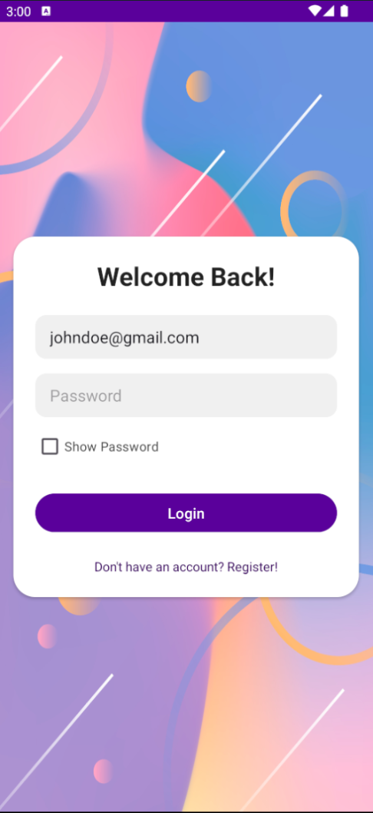
  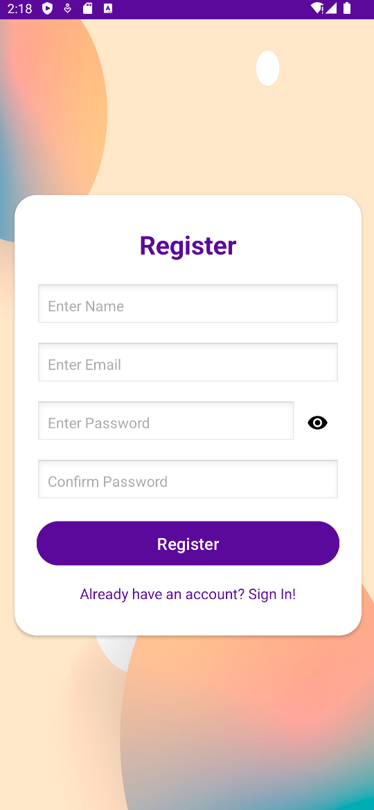

---

## Home Screen
- Users can **type their mood** in the search bar or **speak** using the microphone button.  
- When the **Get Mood** button is pressed, the AI model analyzes the input and generates the most fitting mood.
- Currently supported moods: **Happy**, **Sad**, **Angry**  

  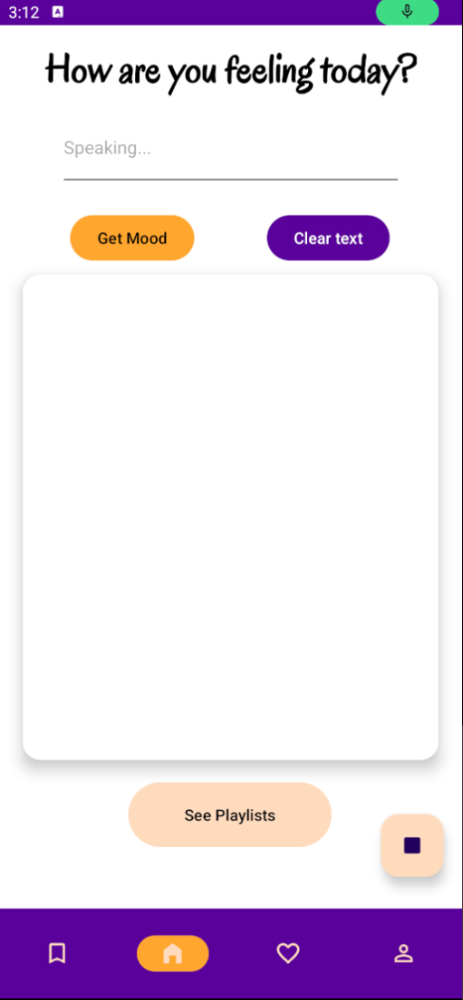
  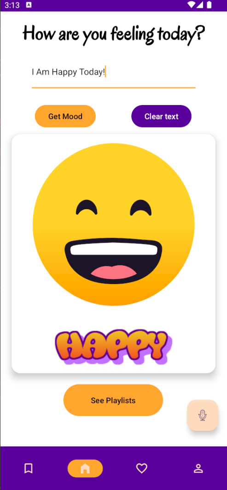
  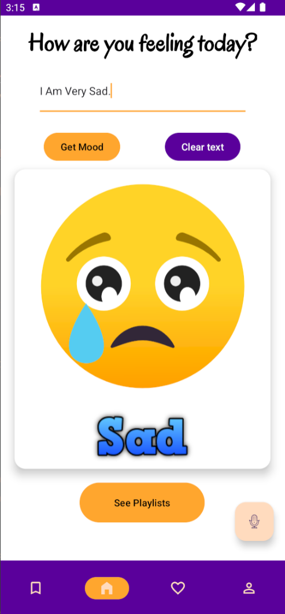
  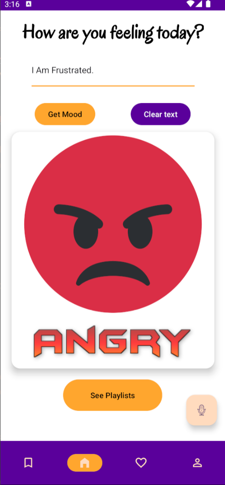

---

## Playlists
- Once a mood is generated, the **See Playlists** button becomes available.  
- Playlists are created based on the user’s preferences (**2 playlists per preference**).  
- Preferences can be managed in the **Profile screen**, where users can:
  - Add a profile image  
  - Add or remove preferences for specific moods  
- When a playlist is clicked, the user is redirected to **YouTube**, where the first song of the playlist begins playing.  

  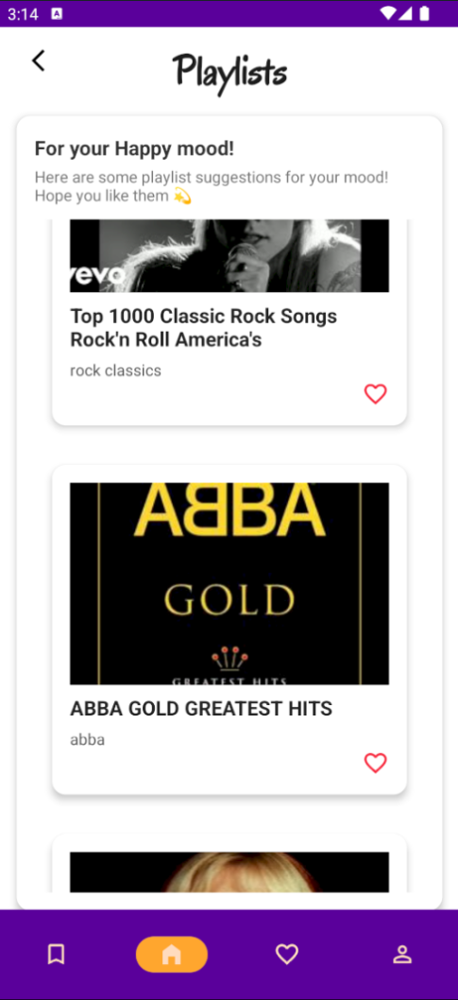
  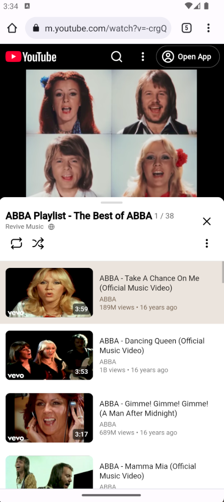
  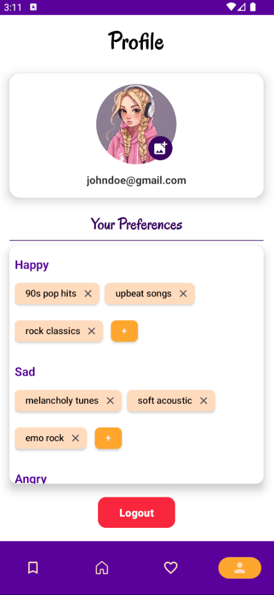
  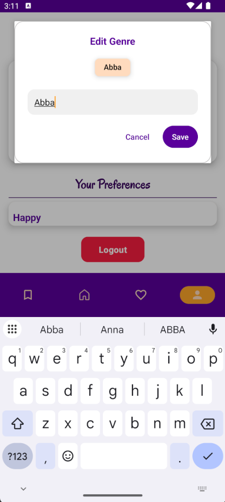

---

## History
- The **History screen** allows users to:
  - View past searches  
  - Delete individual entries or clear all history  
  - Filter by mood  
  - Use the search bar for quick lookup  

  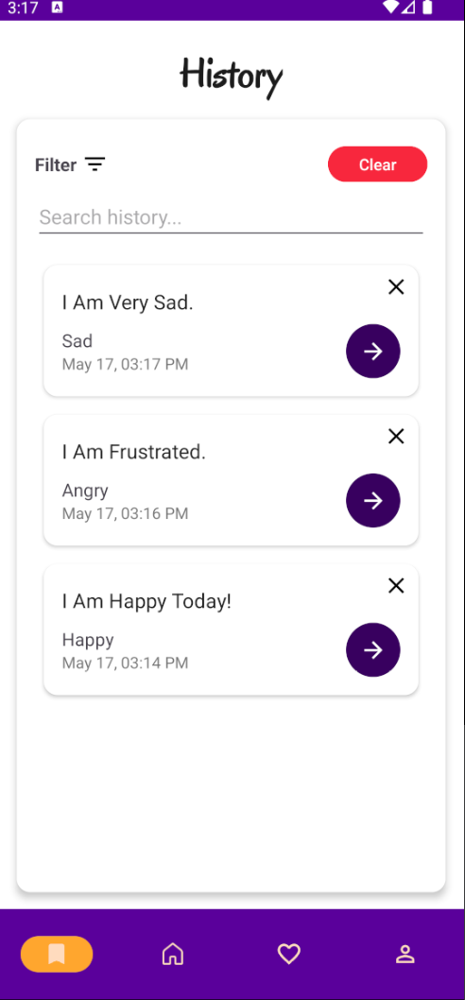
  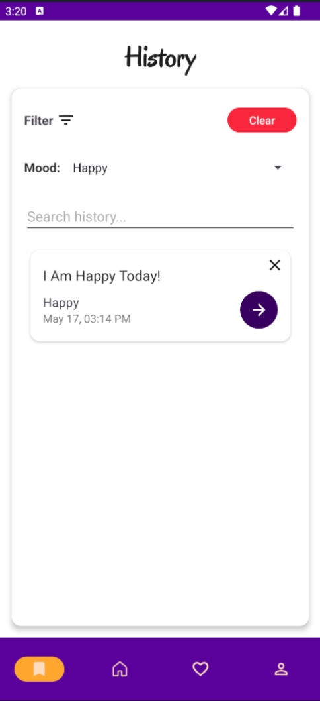
  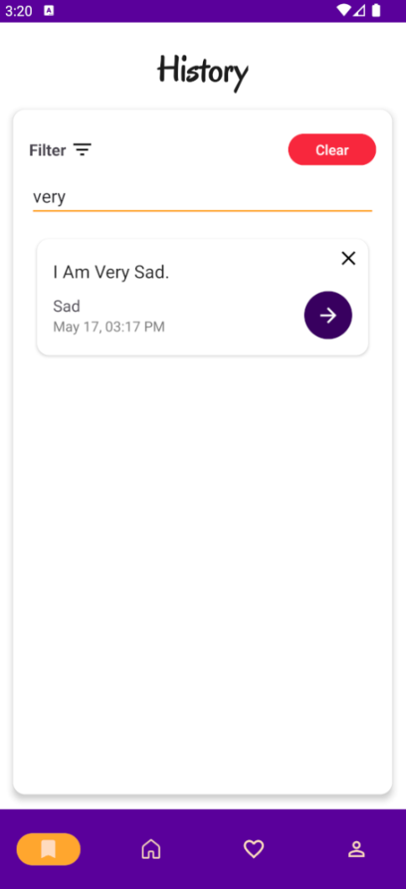

---

## Favorites
- The **Favorites screen** displays playlists marked as favorites.  
- Users can:
  - Unmark favorites  
  - Filter playlists  
  - Search for specific playlists  

  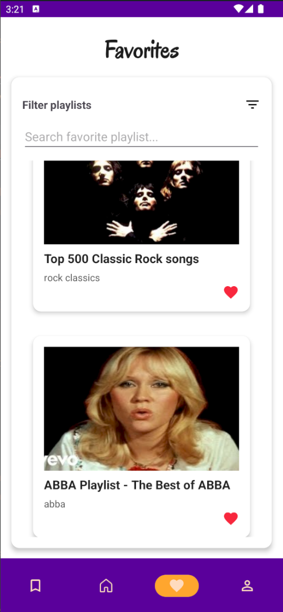
  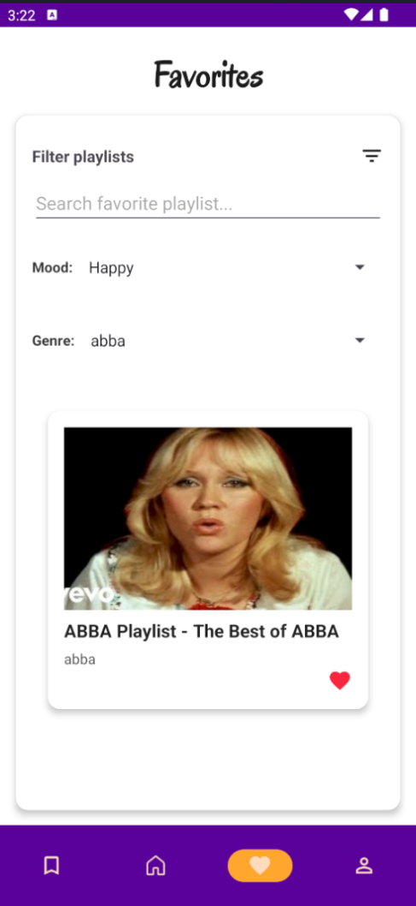
  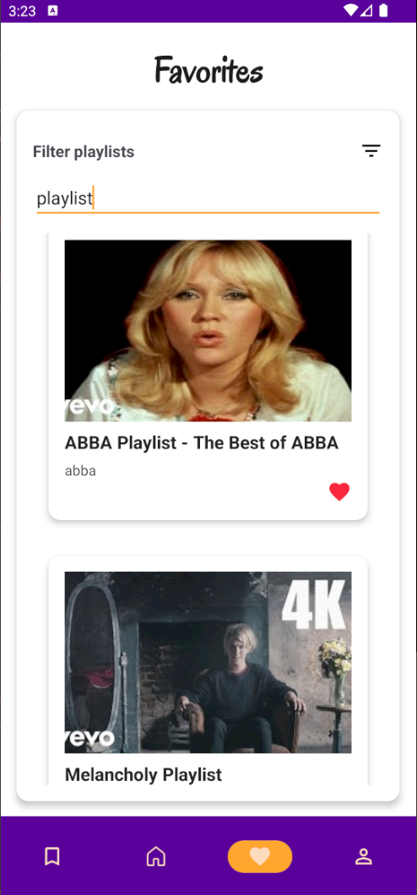

---

## Tech Stack
- **Kotlin**  
- **Firebase Authentication & Firestore**  
- **Room Database**  
- **MVVM Architecture** with Coroutines & Reactive Flows  
- **Integrated AI Model**  
  - Hugging Face model converted to TensorFlow  
  - Runs locally in the app (no external API calls)  
- **YouTube API** for playlist integration  

---
